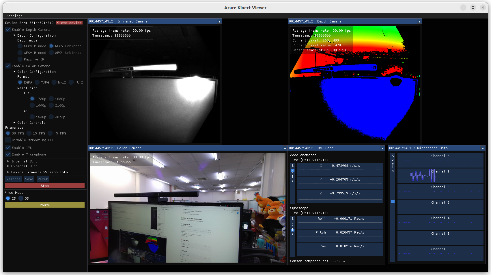

# Azure Kinect SDK Installation Guide

This guide provides step-by-step instructions for installing the Azure Kinect SDK on **Ubuntu**. It includes dependency setup, Microsoft package configuration, SDK installation, and device permission configuration.

---

## 1. Install Dependency: `libsoundio1`

Azure Kinect tools depend on `libsoundio1`, which may not be available in some Ubuntu versions' default repositories. You can manually install it:

```bash
cd ~/Azure_Kinect_DK/Installation
wget http://archive.ubuntu.com/ubuntu/pool/universe/libs/libsoundio/libsoundio1_1.1.0-1_amd64.deb
sudo dpkg -i libsoundio1_1.1.0-1_amd64.deb
```

---

## 2. Configure Microsoft Package Repository

To access the Azure Kinect SDK packages:

```bash
sudo apt update
sudo apt install curl software-properties-common apt-transport-https
curl -sSL https://packages.microsoft.com/keys/microsoft.asc | sudo apt-key add -
sudo add-apt-repository "deb [arch=amd64] https://packages.microsoft.com/ubuntu/18.04/prod bionic main"
```

> ⚠️ Note: Although this repository is listed under Ubuntu 18.04, it works on many newer Ubuntu versions.

---

## 3. Install Azure Kinect SDK Packages

Install the SDK runtime, development files, and tools:

```bash
sudo apt update
sudo apt install libk4a1.4 libk4a1.4-dev k4a-tools
```

---

## 4. Set Up Device Permissions

To access the Azure Kinect device as a non-root user, set up udev rules:

```bash
cd ~/Azure_Kinect_DK/Installation
# You can download the rules file from GitHub if not already present
# wget https://github.com/microsoft/Azure-Kinect-Sensor-SDK/blob/develop/scripts/99-k4a.rules

sudo cp 99-k4a.rules /etc/udev/rules.d/
sudo udevadm control --reload-rules
sudo udevadm trigger
```

---

## 5. Verify Device Permissions

Run the following command to verify that the Azure Kinect device has the correct permissions:

```bash
ls -l /dev/bus/usb/001/029
```

You should see output like:

```
crw-rw-rw- 1 root plugdev 189, 28  四  24 17:29 /dev/bus/usb/001/029
```

---

## 6. Launch Viewer GUI

To test the device with a graphical interface:

```bash
k4aviewer
```

If the viewer launches and shows live streams from the device, the setup is complete.





